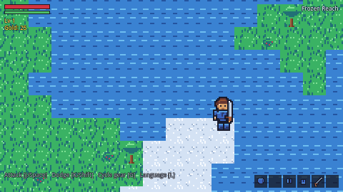
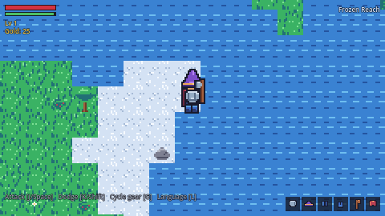
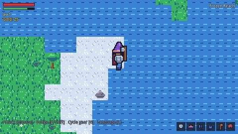
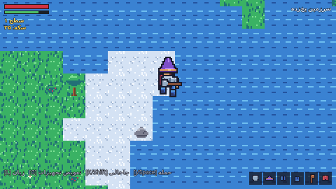
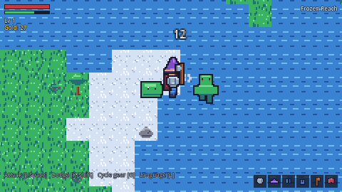
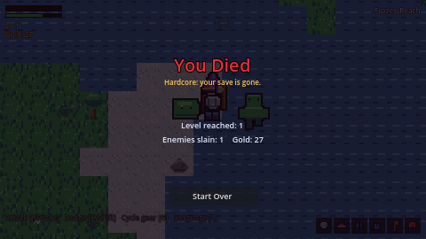

# 2D-RPG

A hardcore, **offline**, pixel-art 2D RPG for Android, built with **Godot 4.4**
and GDScript. Bilingual **English / Persian (Farsi)** with real right-to-left
layout and Persian numerals.

Rebuilt from scratch on 2026-09-05 after an audit showed the previous codebase
did not compile and contained no working gameplay (see
[`docs/AUDIT_OF_PREVIOUS_BUILD.md`](docs/AUDIT_OF_PREVIOUS_BUILD.md)).
Progress is tracked in [`ROADMAP.md`](ROADMAP.md) — every completed item there
is backed by an automated check or a screenshot, never by a self-reported tick.

## Screenshots (real engine renders, captured via `tools/screenshot.tscn`)

| | |
|---|---|
|  |  |
| Procedural overworld, 7 biomes, live HUD | Paper-doll: hat + plate + cloak + axe on the hero |
|  |  |
|  |  |
| Stamina-gated attack swing | Persian + RTL + Persian digits |

## What is actually here (M0 + part of M1)

- Boots, renders, and is **solid**: tile collision, no tunneling, camera that
  follows the hero.
- A **paper-doll equipment renderer**: seven sprite layers stacked per
  character (`accessory → body → legs → boots → chest → helmet → weapon`), all
  sharing one animation grid, so any equipped item is visible on the character
  in every direction and frame. 26 equipment pieces ship in the repo.
- All pixel art is **generated**, not drawn by hand: `tools/gen_assets.py`
  emits every PNG (hero, equipment layers, terrain, props, enemies, icons)
  plus `src/data/art_index.gd`, which is the single source of truth the game
  code reads. CI asserts the committed PNGs match the generator.
- Bilingual UI with a bundled **Vazirmatn** font (SIL Open Font License,
  `assets/fonts/OFL-Vazirmatn.txt`) so Persian actually renders.
- A headless test suite (`tests/verify.tscn`, 74 checks) that exits non-zero on
  failure, and a CI workflow that runs it. The previous CI hard-coded
  `failures='0'`; this one cannot lie.

## Run it

```bash
# editor
godot -e --path .

# headless boot check
godot --headless --path . --quit-after 120

# automated checks
godot --headless --path . res://tests/verify.tscn

# rendered screenshots (virtual display is fine)
xvfb-run -a -s "-screen 0 1440x810x24" godot --path . res://tools/screenshot.tscn
```

## Regenerate the art

```bash
pip install pillow
python3 tools/gen_assets.py
git diff --stat assets/ src/data/art_index.gd   # should be empty in CI
```

## Project layout

```
project.godot            Godot project (pixel-art settings, input map)
assets/
  fonts/                 Vazirmatn (OFL) — Persian glyph coverage
  sprites/               generated PNGs (committed)
  locale/                en.json / fa.json
src/
  autoload/              Game (state), Stats (vitals), I18N (locale/RTL)
  data/                  art_index.gd (generated), item/enemy tables
  entities/              hero.gd, paper_doll.gd
  world/                 world.gd (biomes + TileMapLayers + collision)
  ui/                    hud.gd
tools/                   gen_assets.py, screenshot.tscn
tests/                   verify.tscn (the 33-check suite)
docs/                    audit of the previous build, screenshots
```

## Design rules this codebase follows

1. **Never disable warnings to make a build pass.** The `[debug]` section that
   silenced ten GDScript warning categories is gone and stays gone.
2. **One source of truth per value.** Stamina lives only in `Stats`; the frame
   grid lives only in `art_index.gd`.
3. **Everything is verified by a machine.** If it isn't checked by
   `verify.tscn`, CI, or a screenshot, it isn't claimed as done.
4. **Offline only.** No network calls, no telemetry, no ads.

## Licenses

- Code: MIT (see `LICENSE`).
- Vazirmatn font: SIL Open Font License 1.1 (see `assets/fonts/OFL-Vazirmatn.txt`).
